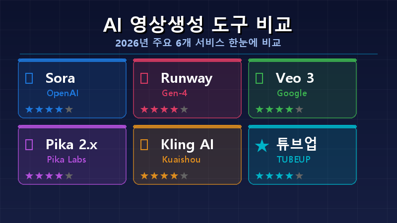
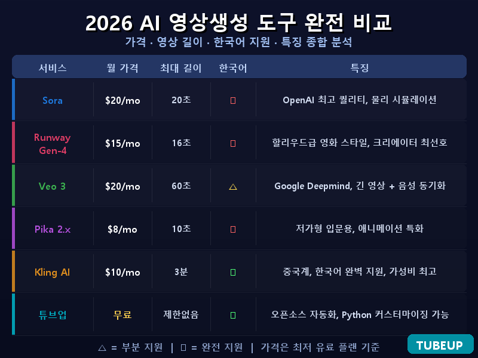
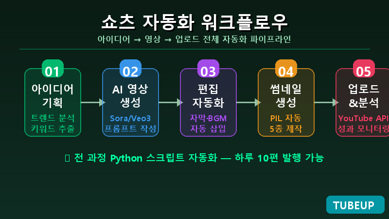
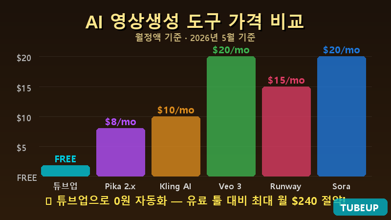
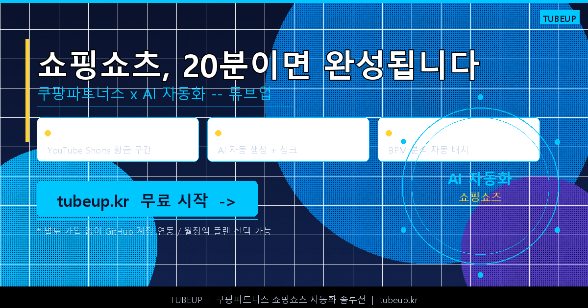

## 편집 못해도 됩니다. AI가 다 해줍니다.

2026년, 유튜브 쇼핑쇼츠는 더 이상 '대형 크리에이터만의 전유물'이 아닙니다.

구독자 0명의 계정에서 쇼핑쇼츠 하나가 47만 뷰를 기록하고, 쿠팡파트너스 수수료로 월 80만 원을 벌어들인 사례가 실제로 나오고 있습니다. 비결은 단 하나 — **AI 자동화**입니다.

이 글에서는 쇼핑쇼츠가 왜 지금 가장 쉬운 부업인지, 조회수가 폭발하는 영상 구조는 무엇인지, 그리고 AI로 영상 1개를 20분 안에 완성하는 워크플로우까지 전부 알려드립니다.

---

## 1. 2026년, 쇼핑쇼츠가 최강의 부업인 이유

유튜브 쇼핑쇼츠는 일반 쇼츠와 다릅니다. 제품 링크를 영상에 직접 태그할 수 있고, 시청자가 링크를 타고 구매하면 수수료가 발생합니다. 여기에 쿠팡파트너스를 연결하면 **복리형 수익 구조**가 완성됩니다.

**왜 지금이 기회인가?**

- **유튜브 알고리즘 우대**: 쇼핑 기능이 탑재된 쇼츠는 비쇼핑 쇼츠 대비 노출 빈도가 높습니다
- **구매 의도 높은 시청자 유입**: "이거 어디서 사요?"를 검색하는 사람들이 쇼핑쇼츠로 직접 들어옵니다
- **복리 구조**: 영상은 한 번 올리면 삭제 전까지 계속 수수료를 발생시킵니다
- **진입 장벽 붕괴**: AI 편집 도구 덕분에 촬영·편집 지식이 없어도 오늘 바로 시작 가능

2026년 기준 쿠팡파트너스 평균 수수료율은 카테고리별 **2~14%**. 2만 원짜리 주방 가젯 하나를 월 100개 판매하면 최대 28만 원의 수동 수입이 생깁니다. 영상 30개를 쌓으면 그게 동시에 30개의 수익 파이프라인이 됩니다.

<!-- 💰 [COUPANG_LINK #1] — 쿠팡파트너스 회원가입 직링크 (초반 진입 동기부여 위치) -->
<!-- 예: > 👉 [쿠팡파트너스 무료 가입하기](https://partners.coupang.com/) — 가입 5분, 승인 즉시 시작 -->

---

## 2. 조회수 터지는 쇼핑쇼츠의 구조 (벤치마크 분석)

700만 뷰 이상을 기록한 쇼핑쇼츠들을 분석하면 **공통된 패턴**이 보입니다.

### ⏱ 영상 길이 & 컷 구성

| 항목 | 평균값 | 최적 범위 |
|------|:------:|:--------:|
| 전체 길이 | 32초 | 28~37초 |
| 총 컷 수 | 29컷 | 27~35개 |
| 컷당 평균 시간 | 1.1초 | 0.9~1.5초 |
| 첫 후크 길이 | 3초 이내 | 2~3초 |

### 📝 자막 공식 (커뮤니티 검증 완료)

- **폰트**: 굵은 흰 글씨 + 검정 외곽선 필수 (가독성 최우선)
- **강조 단어**: 노랑 또는 빨강으로 1~2단어 하이라이트
- **위치**: 화면 상단 30% (스크롤 중에도 눈에 띄는 위치)
- **첫 화면 자막**: 130px 이상 대형 텍스트로 즉각 후킹

### 🎵 BGM 공식

- 장르: Lo-fi, 경쾌한 팝 (BPM 140~180)
- 볼륨: 원본 영상 대비 13~18% (자막·나레이션 방해 없는 수준)
- 마지막 2초: 페이드아웃 필수 (끊기는 느낌 방지)

---

## 3. 쿠팡파트너스 × 유튜브 쇼츠: 수익 시뮬레이션

막연히 "돈이 될까?"가 아니라, 실제 수치로 계산해봤습니다.

**가정: 주방 가젯 쇼핑쇼츠 채널 (월 30개 업로드)**

| 항목 | 보수적 시나리오 | 현실적 시나리오 | 낙관적 시나리오 |
|------|:-----------:|:-----------:|:-----------:|
| 영상 1개 평균 조회수 | 3,000 | 15,000 | 80,000 |
| 링크 클릭률 | 1% | 2% | 3% |
| 구매 전환율 | 3% | 5% | 8% |
| 평균 제품 단가 | 2만원 | 3만원 | 5만원 |
| 수수료율 | 3% | 5% | 8% |
| **월 30개 기준 예상 수익** | **약 3만원** | **약 68만원** | **약 460만원** |

> ※ 위 수치는 시뮬레이션 예시입니다. 실제 결과는 채널 성장도·제품 카테고리·영상 품질에 따라 다릅니다.

핵심은 **영상 수가 많을수록 수익 파이프라인이 두터워진다**는 것입니다. 월 30개를 꾸준히 6개월 올리면 총 180개의 영상이 동시에 수수료를 벌어오는 구조가 만들어집니다. 이것이 쇼핑쇼츠가 단순 부업을 넘어 '자산'이 되는 이유입니다.

<!-- 💰 [COUPANG_LINK #2] — 추천 카테고리(주방가젯/뷰티/생활용품) 인기 상품 리스트 링크 -->
<!-- 예: > 👉 [지금 가장 잘 나가는 주방 가젯 TOP10 보기 (쿠팡)](https://link.coupang.com/...) -->

---

## 4. 수동 제작 vs AI 자동화: 이 표 하나로 결론 납니다

많은 분들이 "어차피 편집 배우면 되지 않나?"라고 생각합니다. 실제 비교를 보시면 생각이 달라집니다.

| 항목 | 수동 제작 | AI 자동화 (튜브업) |
|------|:--------:|:---------------:|
| 영상 1개 제작 시간 | 2~4시간 | **10~20분** |
| 필요 장비 | 카메라, 마이크, 편집 PC | 인터넷 연결만 |
| 편집 학습 기간 | 최소 2~4주 | **0일 (바로 시작)** |
| 월 50개 제작 가능 여부 | ❌ 사실상 불가 | ✅ 가능 |
| 자막 생성 | 수동 타이핑 | **AI 자동 생성** |
| BGM 저작권 | 직접 확인 필요 | **라이선스 프리 자동 매칭** |
| 외주 시 비용 | 건당 5~15만원 | **무료~저렴** |

결론: 수동 제작은 '영상 1편의 완성도'에 유리하고, AI 자동화는 **'볼륨 × 꾸준함'**에 압도적으로 유리합니다.

알고리즘이 원하는 건 완벽한 1편이 아니라 **꾸준한 업로드**입니다. 한 달에 2~3편을 정성껏 만드는 것보다, 30~50편을 AI로 빠르게 만드는 채널이 구독자 증가 속도에서 실제로 앞서고 있습니다.

---

## 5. AI 쇼핑쇼츠 자동화 실전 워크플로우 (5단계)

지금 당장 따라할 수 있는 워크플로우입니다. 총 소요 시간: 영상 1개당 **약 20분**.

**STEP 1 — 제품 선정 (5분)**

쿠팡파트너스 대시보드에서 인기 상품 탐색 → 수수료율·가격·리뷰 수 확인. 추천 기준: 가격 2~5만원대 / 리뷰 1,000개 이상 / 수수료 5% 이상 / 주방·생활가젯·뷰티 카테고리.

<!-- 💰 [COUPANG_LINK #3] — 워크플로우 STEP1 직후 (제품 선정 가이드 → 실제 제품 페이지로 자연 연결) -->
<!-- 예: > 👉 [이번 주 베스트 주방 가젯 보기](https://link.coupang.com/...) — STEP1 실습용 -->

**STEP 2 — 소스 영상 수집 (5분)**

쿠팡·아마존·알리익스프레스 상품 페이지의 공식 제품 영상, 또는 Creative Commons 라이선스 영상 다운로드. 10~15개 클립을 모으면 충분합니다. 직접 촬영이 없어도 됩니다.

**STEP 3 — AI 자동 편집 (5분)**

수집한 클립을 **튜브업**에 업로드하면:
- 쇼핑쇼츠 최적 길이(30~37초)로 자동 재편집
- AI가 강조 컷·클로즈업·CTA 타이밍 자동 배치
- 한국어 자막 + 강조 단어 컬러 하이라이트 자동 생성
- BPM 분석 후 분위기에 맞는 BGM 자동 삽입

**STEP 4 — 쿠팡파트너스 링크 삽입 (3분)**

완성된 영상 설명란에 제품 파트너스 링크 삽입. 유튜브 쇼핑 탭 설정 시 영상 내 직접 태그도 가능합니다.

**STEP 5 — 예약 발행 (2분)**

유튜브 스튜디오에서 최적 업로드 시간(주중 오전 9~11시 / 저녁 7~9시)으로 예약 설정. 하루 1~2개 예약 발행 스케줄을 구성해두면 채널이 자동으로 굴러갑니다.

> 💡 **하루 1시간 투자** → 영상 3개 제작 → 월 90개 적립 가능

---

## 6. 쇼핑쇼츠 조회수 올리는 실전 꿀팁 5가지

단순히 영상을 올리는 것과, **알고리즘에 최적화해서** 올리는 것은 조회수에서 수배 차이가 납니다.

1. **첫 3초 후킹이 전부**: "이거 몰랐으면 돈 손해 😱" / "주방 필수템인데 왜 모르지?" 처럼 궁금증을 즉시 유발하는 오프닝
2. **제목에 숫자 + 감탄**: "3초 만에 채소 다지기 😱" vs "채소 다지기 도구 소개" — 전자가 클릭률 3배 이상
3. **해시태그 전략**: `#쇼핑 #추천템 #주방가젯 #shorts` + 제품 카테고리 전용 태그 병행
4. **댓글 유도 CTA**: 영상 마지막 자막에 "👇 링크 댓글에!" 삽입 → 댓글 참여 = 알고리즘 긍정 신호
5. **시리즈화**: 같은 카테고리(예: 주방 가젯 시리즈) 묶음으로 올리면 시청자 재방문율·구독 전환율 모두 상승

<!-- 💰 [COUPANG_LINK #4] — 꿀팁 직후 (구체 실습용 추천 상품 묶음) -->
<!-- 예: > 👉 [이 꿀팁대로 만들어볼 추천 상품 5선 보기](https://link.coupang.com/...) -->

---

## 7. 지금 바로 시작하세요 — 튜브업

AI 자동화 툴이 많지만, **한국 쇼핑쇼츠 크리에이터에게 최적화**된 도구는 단연 **튜브업**입니다.

### 튜브업이 선택받는 이유

🎬 **소스 영상 자동 짜깁기**
클립만 올리면 AI가 쇼핑쇼츠 최적 포맷(30~37초, 27~35컷)으로 자동 완성. 직접 촬영 없이도 완성본이 나옵니다.

📝 **한국어 자막 자동 생성**
AI 음성 인식 → 한국어 자막 자동 삽입 → 굵은 흰 글씨 + 강조 단어 컬러 하이라이트 자동 적용까지.

🎵 **BGM 자동 매칭**
BPM 분석으로 영상 분위기에 맞는 저작권 프리 BGM 자동 선택·삽입. 볼륨 자동 최적화 포함.

✂️ **쇼츠 알고리즘 최적화 편집**
알고리즘이 선호하는 컷 구성(평균 1~1.5초/컷), 인트로 후킹, CTA 타이밍을 AI가 자동 설계.

🛒 **쇼핑쇼츠 전용 최적화**
쿠팡파트너스 연계 쇼핑쇼츠에 특화 — 제품 클로즈업 컷, 가격 비교 컷, 구매 유도 CTA 타이밍까지 자동으로.

---

> **"소스 영상만 있으면 오늘부터 하루 1~3개 업로드 가능."**

👉 **지금 바로 튜브업에서 무료로 첫 쇼핑쇼츠를 완성하세요!**
🔗 [https://tubeup.kr](https://tubeup.kr)

_첫 가입 시 무료 크레딧 제공 — 신용카드 없이 바로 시작 가능_

<!-- 💰 [COUPANG_LINK #5] — 본문 최하단 (마무리 직전, 액션 트리거 위치) -->
<!-- 예: > 👉 [지금 잘 팔리는 쇼핑쇼츠용 가성비 상품 BEST30 보기](https://link.coupang.com/...) -->

---

## 결론

- **쇼핑쇼츠 × 쿠팡파트너스 조합**은 2026년 현재 진입장벽이 가장 낮고 수익 구조가 안정적인 1인 부업입니다
- 조회수 폭발 영상의 공식은 정해져 있습니다 — 30~37초, 27~35컷, 굵은 자막, Lo-fi BGM
- AI 자동화(튜브업)를 활용하면 영상 1개에 20분, 월 50개도 충분히 현실입니다

처음 시작이 가장 어렵습니다. 지금 튜브업에서 무료 크레딧으로 첫 영상을 만들어보세요. 10분이면 충분합니다.

---

💬 **이 글이 도움이 됐다면, 댓글로 어떤 제품으로 시작했는지 알려주세요!**
📤 쿠팡파트너스 시작을 고민 중인 지인에게 공유하면 그들에게도 큰 도움이 됩니다.

---

> ⚠️ **광고/제휴 고지**: 본 포스팅은 쿠팡파트너스 활동의 일환으로, 이에 따른 일정액의 수수료를 제공받을 수 있습니다. (쿠팡파트너스 광고법 필수 고지)

_작성일: 2026년 5월 21일 | 작성: 튜브업 마케팅팀_
